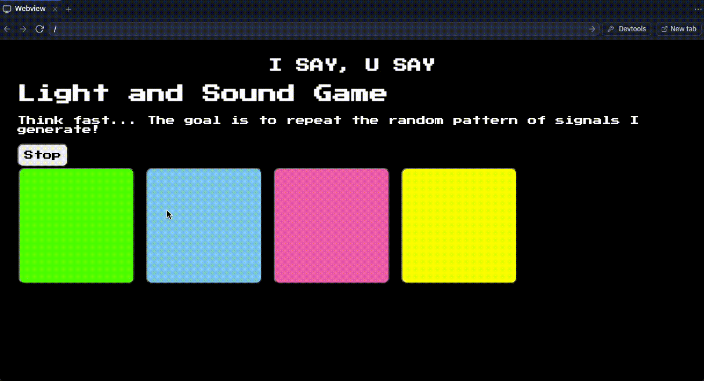

# *Light & Sound Game*

**Light & Sound Game** is an interactive experience where players navigate through levels by using both visual and auditory cues.

## Functionality
* [✅] "Start" button toggles between "Start" and "Stop" when clicked. 
* [✅] Game buttons each light up and play a sound when clicked. 
* [✅] Computer plays back sequence of clues including sound and visual cue for each button
* [✅] Play progresses to the next turn (the user gets the next step in the pattern) after a correct guess. 
* [✅] User wins the game after guessing a complete pattern
* [✅] User loses the game after an incorrect guess

## Resources

https://www.codecademy.com/resources/docs/javascript
https://developer.mozilla.org/en-US/docs/Web/CSS
https://www.w3schools.com/howto/tryit.asp?font=Press%20Start%202P
https://www.w3schools.com/js/js_htmldom_eventlistener.asp
https://www.w3docs.com/snippets/html.html
https://noaheakin.medium.com/adding-sound-to-your-js-web-app-f6a0ca728984#:~:text=The%20simplest%20way%20to%20add,starts%20playing%20the%20current%20audio.

## Video Walkthrough 
![losing screen recording]https://drive.google.com/file/d/1LQNd8jXd7-o_mgnUhb-KFBSXn7h0SKNI/view?usp=sharing
![winning screen recording]https://drive.google.com/file/d/1sJhG62ytvPigAN-ezwTP0iLzjc713K2y/view?usp=sharing

## License

    Copyright [Nnaemeka Okonkwo]

    Licensed under the Apache License, Version 2.0 (the "License");
    you may not use this file except in compliance with the License.
    You may obtain a copy of the License at

        http://www.apache.org/licenses/LICENSE-2.0

    Unless required by applicable law or agreed to in writing, software
    distributed under the License is distributed on an "AS IS" BASIS,
    WITHOUT WARRANTIES OR CONDITIONS OF ANY KIND, either express or implied.
    See the License for the specific language governing permissions and
    limitations under the License.
